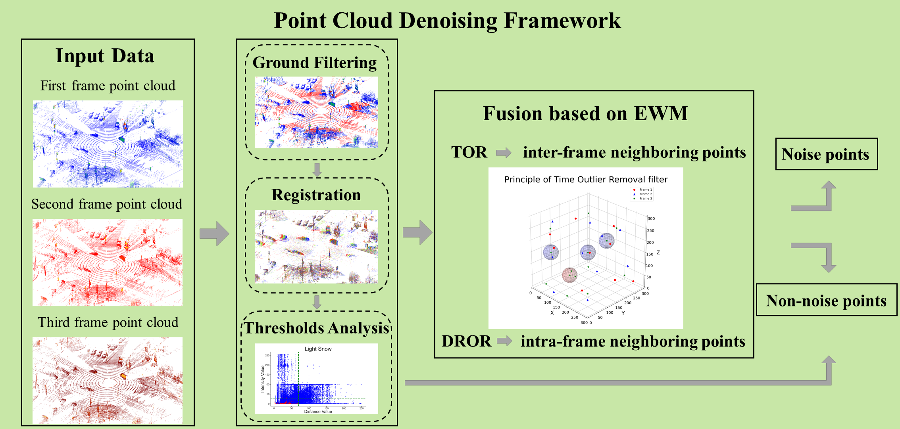
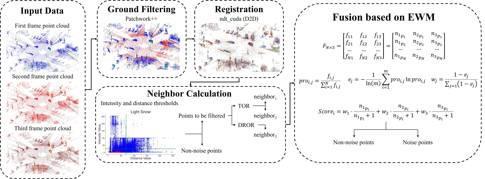
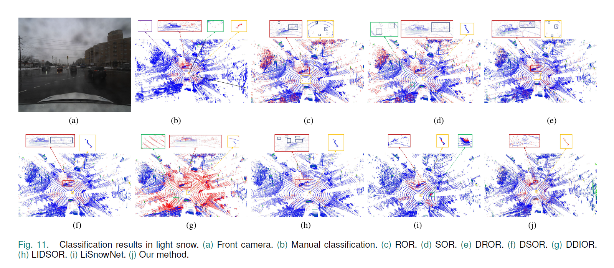
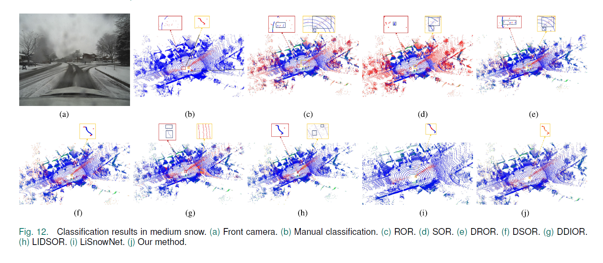
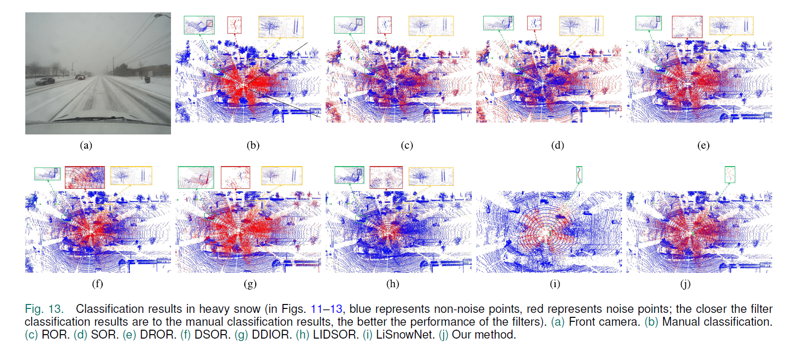

# Denoising Framework Based on Multi-frame Continuous Point Clouds for Autonomous Driving LiDAR in Snowy Weather

### [Paper](https://ieeexplore.ieee.org/abstract/document/10418150)

> Denoising Framework Based on Multi-frame Continuous Point Clouds for Autonomous Driving LiDAR in Snowy Weather

> [Xinyuan Yan](https://naclzno.github.io/Xinyuan-Yan/) $\dagger$, Junxing Yang, Xinyu Zhu, Yu Liang, and He Huang $\ddagger$

$\dagger$ Project leader $\ddagger$ Corresponding author

## Highlights

- **We introduce the prior knowledge that snow noise points have the disorder and propose a framework for denoising multiframe continuous point clouds in snowy weather for autonomous driving LiDAR. In the denoising framework, we use ground filtering, point cloud registration, threshold analysis, and EWM.**
- **In the denoising framework, we design a TOR filter based on the disorder of noise points.**
- **To retain more dynamic nonsnow point objects, we fused three metrics on neighboring points based on the EWM approach, which allows our method to remove not only dynamic airborne snow points, but also disordered noise points such as moving vehicles and their trailing shadow, and ghosting of stationary objects on the ground.**

<p align="center">
    
</p>

## Abstract

Adverse weather conditions are one of the long-tailed problems facing autonomous driving. Solving the problem of autonomous driving operation in adverse weather conditions is an important challenge for realizing advanced autonomous driving. To enhance the LiDAR perception capability in snowy weather for autonomous driving, this study proposes a denoising method for multiframe continuous point clouds. The core concept of this method is to allow ordered objects (e.g., stationary objects on the ground) to strengthen each other while allowing disordered objects (e.g., snow) to weaken each other. This is done by first selecting three consecutive frames of the point cloud as a denoising unit and then removing the ground points from each frame of the point cloud. After that, the point clouds from the first two frames are used as the source point clouds, and the point cloud from the third frame is used as the target point cloud for point cloud registration. Finally, the time outlier removal (TOR) filter proposed in this article combined with the entropy weight method (EWM) is utilized for denoising. The experimental results show that the performance of the method proposed in this article exceeds the existing methods. In addition, the method in this article not only removes the disordered snowflakes in the air, but also removes some other disordered noise points (e.g., the ghosting of the stationary objects), which provides an advantageous guarantee for the realization of automatic driving in snowy weather.



## Qualitative Results

### Light snow



### Medium snow



### Heavy snow



<!-- ## Installation

1. Create a conda environment and activate it.

```
conda create -n AdverseNet python=3.8
conda activate AdverseNet
```

2. Install PyTorch and torchvision following the [official instructions](https://pytorch.org/).

```
pip install torch==1.10.0+cu113 torchvision==0.11.0+cu113 torchaudio==0.10.0 -f https://download.pytorch.org/whl/torch_stable.html
```

3. Follow instructions in https://mmdetection3d.readthedocs.io/en/latest/get_started.html#installation to install mmcv-full, mmdet, mmsegmentation and mmdet3d

```
pip install -U openmim
mim install mmengine
mim install 'mmcv>=2.0.0rc4'
mim install 'mmdet>=3.0.0'
mim install mmsegmentation
mim install "mmdet3d>=1.1.0rc0"
```

4. install other packages

```
pip install timm==0.4.12
pip install torch_scatter
pip install spconv-cu113
pip install scikit-image==0.19.3
pip install pandas==1.4.4
``` -->

<!-- ## Preparing

1. You can download the DENSE dataset [here](https://www.uni-ulm.de/index.php?id=101568) (credit to Heinzler *et al.*) and the SnowyKITTI dataset [here](https://www.dropbox.com/s/o3r654cdzfl405d/snowyKITTI.zip?dl=0) (credit to Seppänen *et al.*).

2. To standardize dataset formats and remove invalid data, first run ./formats/DENSE/hdf5totxt.py to convert the DENSE format from .hdf5 to .txt. Then, use ./formats/DENSE/cnnfilter.py to filter out invalid points.

3. Similarly, use ./formats/DENSE/binlabeltotxt+filter.py to convert the SnowyKITTI format from .bin and .label to .txt while simultaneously removing invalid points. -->


## How to build & Run

------

   ```
   $ cd tor && mkdir build && cd build
   $ cmake ..
   $ make -j 16
   ```

<!-- ## When will we publish the source code?

The source code for the Time Outlier Removal (TOR) filter is scheduled to be published by 2025. We kindly ask for your patience. -->

## Contact
If you have any questions, please contact yan1075783878@gmail.com

## Citation

If you find this project helpful, please consider citing the following paper:
```
@article{yan2024denoising,
  title={Denoising Framework Based on Multi-frame Continuous Point Clouds for Autonomous Driving LiDAR in Snowy Weather},
  author={Yan, Xinyuan and Yang, Junxing and Zhu, Xinyu and Liang, Yu and Huang, He},
  journal={IEEE Sensors Journal},
  year={2024},
  publisher={IEEE}
}
```
